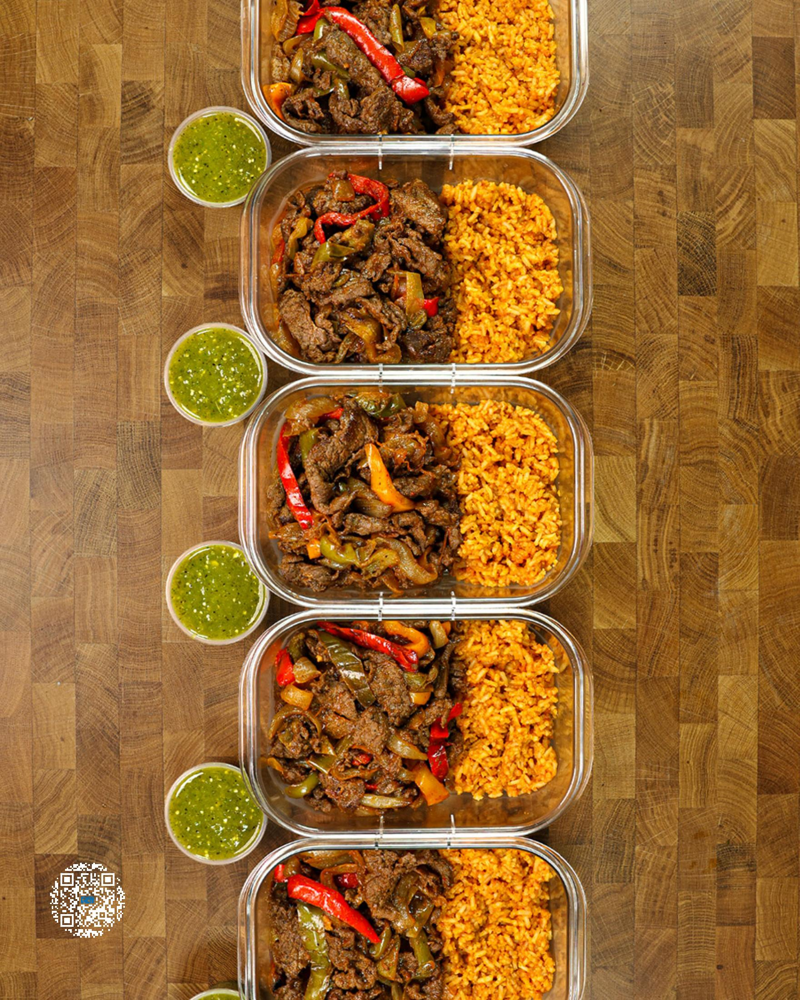
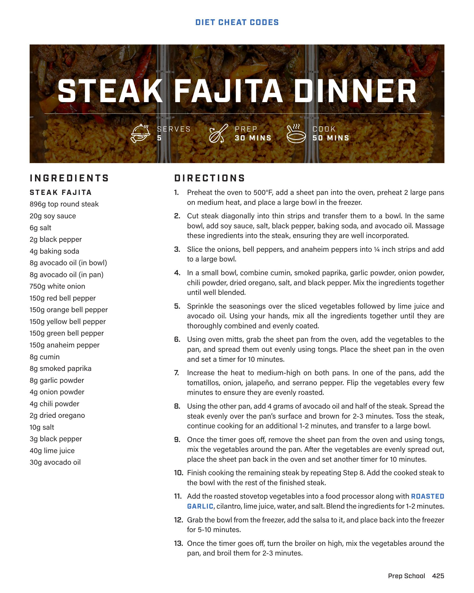
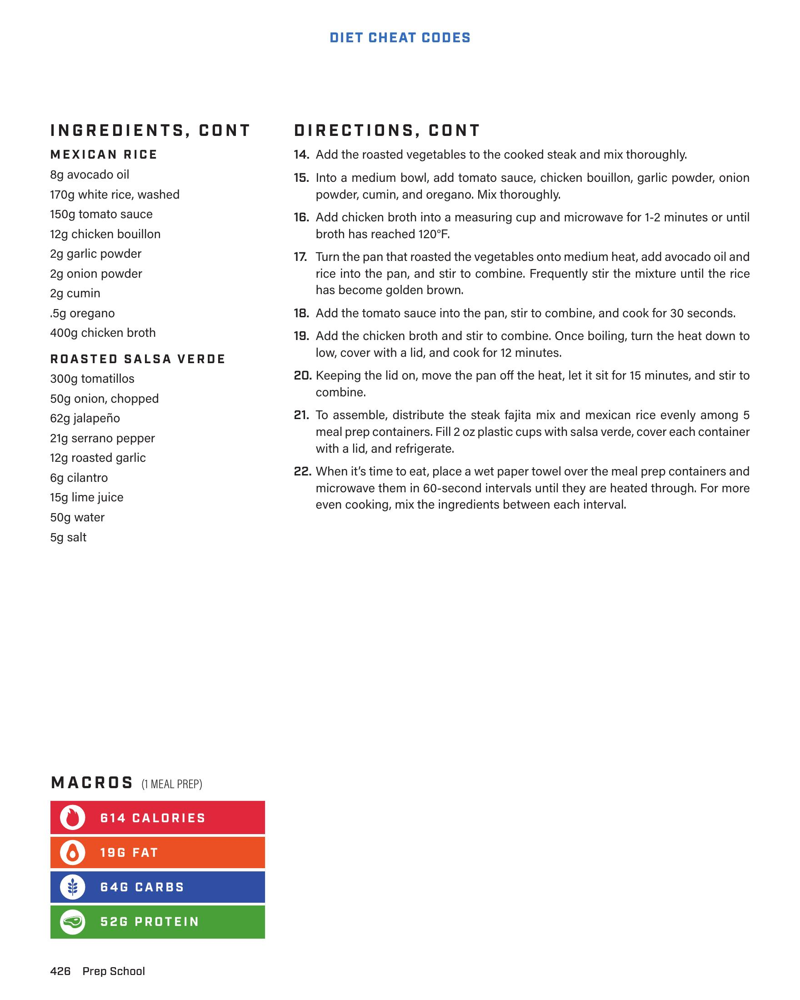

# STEAK FAJITA DINNER

**Serves:** 5 | **Prep:** 30 MINS | **Cook:** 50 MINS

## Macros

| Calories | Fat | Carbs | Net Carbs | Protein |
|----------|-----|-------|-----------|---------|
| 614 | 19 | 64 | undefined | 52 |

## Ingredients

### STEAK FAJITA

- 896g top round steak
- 20g soy sauce
- 6g salt
- 2g black pepper
- 4g baking soda
- 8g avocado oil (in bowl)
- 8g avocado oil (in pan)
- 750g white onion
- 150g red bell pepper
- 150g orange bell pepper
- 150g yellow bell pepper
- 150g green bell pepper
- 150g anaheim pepper
- 8g cumin
- 8g smoked paprika
- 8g garlic powder
- 4g onion powder
- 4g chili powder
- 2g dried oregano
- 10g salt
- 3g black pepper
- 40g lime juice
- 30g avocado oil

### MEXICAN RICE

- 8g avocado oil
- 170g white rice, washed
- 150g tomato sauce
- 12g chicken bouillon
- 2g garlic powder
- 2g onion powder
- 2g cumin
- 5g oregano
- 400g chicken broth

### ROASTED SALSA VERDE

- 300g tomatillos
- 50g onion, chopped
- 62g jalapeno
- 21g serrano pepper
- 12g roasted garlic
- 8g cilantro
- 15g lime juice
- 50g water
- 5g salt

## Directions

1. Preheat the oven to 500°F, add a sheet pan into the oven, preheat 2 large pans on medium heat, and place a large bowl in the freezer.
2. Cut steak diagonally into thin strips and transfer them to a bowl. In the same bowl, add soy sauce, salt, black pepper, baking soda, and avocado oil. Massage these ingredients into the steak, ensuring they are well incorporated.
3. Slice the onions, bell peppers, and anaheim peppers into ¼ inch strips and add to a large bowl.
4. In a small bowl, combine cumin, smoked paprika, garlic powder, onion powder, chili powder, dried oregano, salt, and black pepper. Mix the ingredients together until well blended.
5. Sprinkle the seasonings over the sliced vegetables followed by lime juice and avocado oil. Using your hands, mix all the ingredients together until they are thoroughly combined and evenly coated.
6. Using oven mitts, grab the sheet pan from the oven, add the vegetables to the pan, and spread them out evenly using tongs. Place the sheet pan in the oven and set a timer for 10 minutes.
7. Increase the heat to medium-high on both pans. In one of the pans, add the tomatillos, onion, jalapeno, and serrano pepper. Flip the vegetables every few minutes to ensure they are evenly roasted.
8. Using the other pan, add 4 grams of avocado oil and half of the steak. Spread the steak evenly over the pan's surface and brown for 2-3 minutes. Toss the steak, continue cooking for an additional 1-2 minutes, and transfer to a large bowl.
9. Once the timer goes off, remove the sheet pan from the oven and using tongs, mix the vegetables around the pan. After the vegetables are evenly spread out, place the sheet pan back in the oven and set another timer for 10 minutes.
10. Finish cooking the remaining steak by repeating Step 8. Add the cooked steak to the bowl with the rest of the finished steak.
11. Add the roasted stovetop vegetables into a food processor along with ROASTED GARLIC, cilantro, lime juice, water, and salt. Blend the ingredients for 1-2 minutes.
12. Grab the bowl from the freezer, add the salsa to it, and place back into the freezer for 5-10 minutes.
13. Once the timer goes off, turn the broiler on high, mix the vegetables around the pan, and broil them for 2-3 minutes.
14. Add the roasted vegetables to the cooked steak and mix thoroughly.
15. Into a medium bowl, add tomato sauce, chicken bouillon, garlic powder, onion powder, cumin, and oregano. Mix thoroughly.
16. Add chicken broth into a measuring cup and microwave for 1-2 minutes or until broth has reached 120°F.
17. Turn the pan that roasted the vegetables onto medium heat, add avocado oil and rice into the pan, and stir to combine. Frequently stir the mixture until the rice has become golden brown.
18. Add the tomato sauce into the pan, stir to combine, and cook for 30 seconds.
19. Add the chicken broth and stir to combine. Once boiling, turn the heat down to low, cover with a lid, and cook for 12 minutes.
20. Keeping the lid on, move the pan off the heat, let it sit for 15 minutes, and stir to combine.
21. To assemble, distribute the steak fajita mix and mexican rice evenly among 5 meal prep containers. Fill 2 oz plastic cups with salsa verde, cover each container with a lid, and refrigerate.
22. When it's time to eat, place a wet paper towel over the meal prep containers and microwave them in 60-second intervals until they are heated through. For more even cooking, mix the ingredients between each interval.

## Additional Recipe Pages

## Source Pages

425, 426, 427
